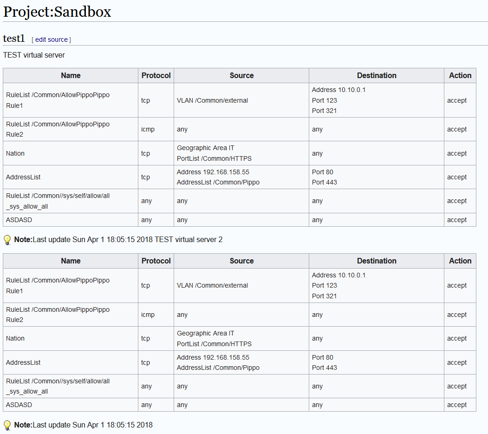
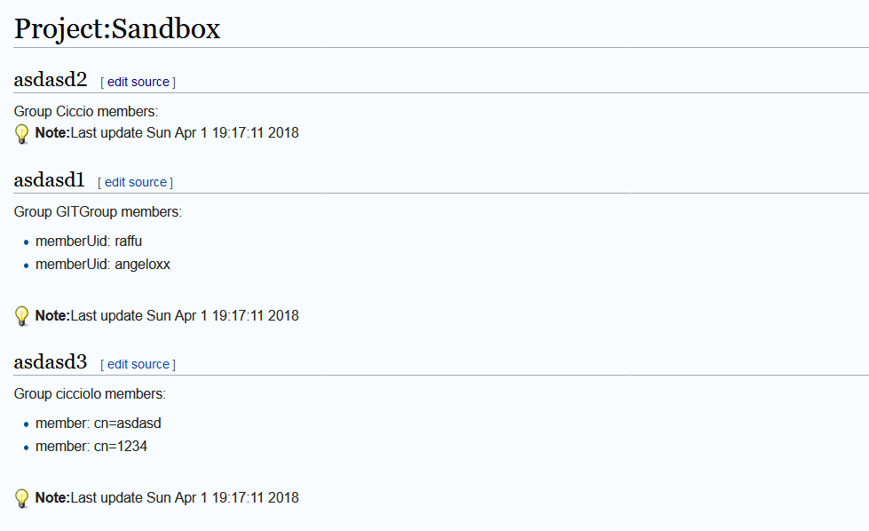

# Introduction

The objective of this project is to document the firewall policies and LDAP groups membership in an environment that uses OpenLDAP and BigIP F5. The daily challenge that this project wants to address is to document and update these informations in a enterprise Mediawiki.

# Prerequisites

    sudo apt-get install libsasl2-dev python-dev libldap2-dev libssl-dev
    sudo yum install python-devel openldap-devel
    pip install mwclient
    pip install f5-icontrol-rest
    pip install f5-sdk
    pip install python-ldap

# Usage

## F5
Create a list of F5's Virtual Server that you want document on your Mediawiki using this format:

    # List the exported vs in name:<vsname>;exporttype:[AFM|VS];title:pagetitle;description:description format
    name:/Common/nonexist;exporttype:AFM;title:notexists;description:This VS does not exists
    name:/Common/test;exporttype:AFM;title:test1;description:TEST virtual server
    name:/Common/test;exporttype:AFM;title:test2 prova 123;description:TEST virtual server 2
    exporttype:AFM;title:AFM;description:This VS does not exists

launch the exporter with:

    python3 f5-export-vs-afm.py --specfile f5-export-vs-afm.list --format wiki --outfile f5-export-vs-afm.wiki --remote f5 --username admin --password password

or
    python3 f5-export-vs-afm.py --specfile f5-export-vs-afm.list --format wiki --outfile f5-export-vs-afm.wiki --remote f5 --username admin --password password --outmode multifile

## LDAP

Create a list of LDAP groups that you want document on your Mediawiki using this format:
    
    # List the exported groups in dn:<cn-group>;title:pagetitle;description:description format
    dn:cn=GITGroup,ou=servicegroups,dc=range-id,dc=web;title:asdasd1
    dn:cn=ciccio,ou=servicegroups,dc=range-id,dc=web;title:asdasd2
    dn:cn=cicciolo,ou=servicegroups,dc=range-id,dc=web;title:asdasd3

launch the exporter with:

    python3 ldap-export.py --specfile ldap-export.list --binddn cn=admin,dc=domain,dc=web --password password --remote ldapserver

or

    python3 ldap-export.py --specfile ldap-export.list --binddn cn=admin,dc=domain,dc=web --password password --remote ldapserver --outmode --multifile
## Mediawiki
Import exported files in mediawiki with:

    python3 mini-mw-editor.py  --content f5-export-vs-afm.wiki --remote www.mediawiki.org --page "Project:Sandbox"

or 

    python3 mini-mw-editor.py  --content f5-export-vs-afm.wiki --remote www.mediawiki.org --page "Project:Sandbox" --subpages

# Mediawiki
The script creates the main page that contains all exported elements OR a master page that uses Embed feature of Mediawiki to import all created subpages. You can import these subpages in your Wiki documents with {{pagename/subpage}} annotation.

## F5 exported configuration

## LDAP group membership
